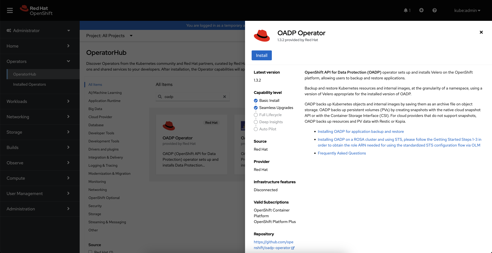
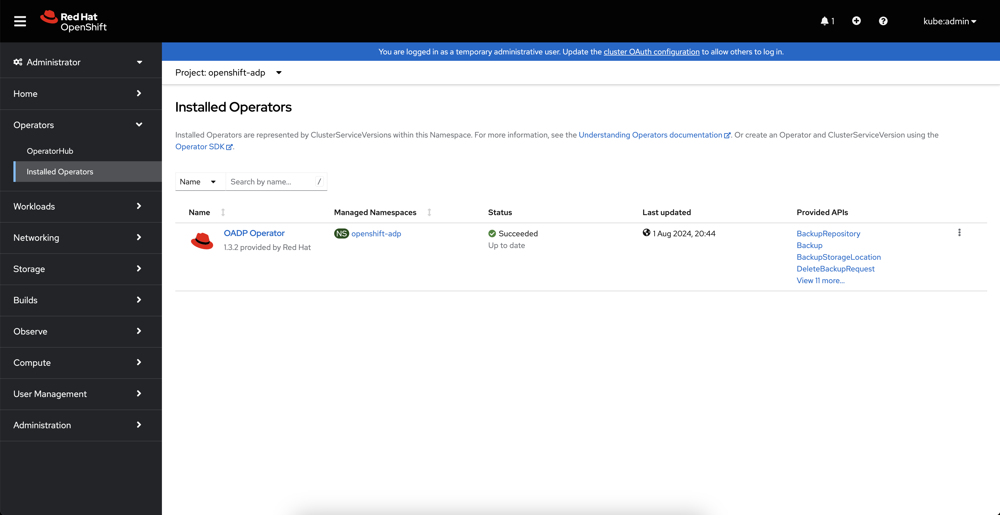
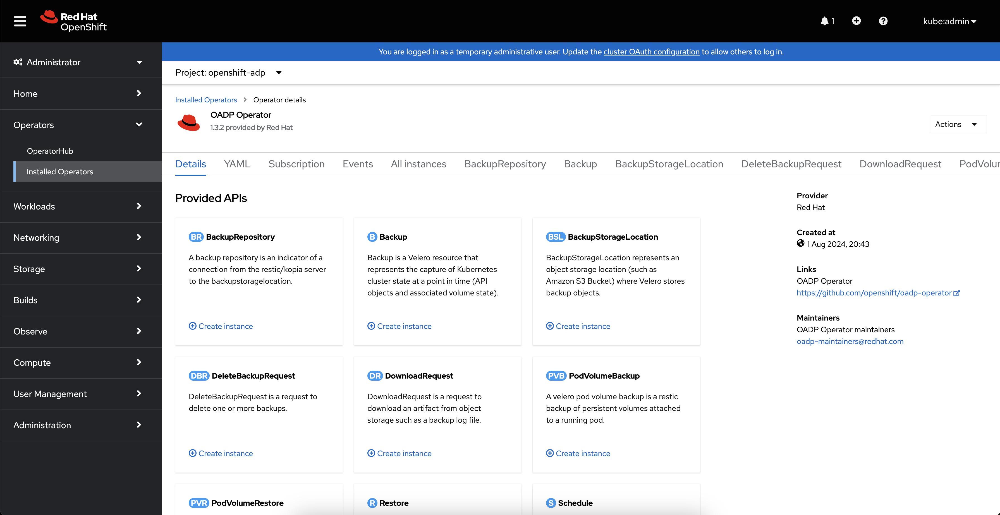
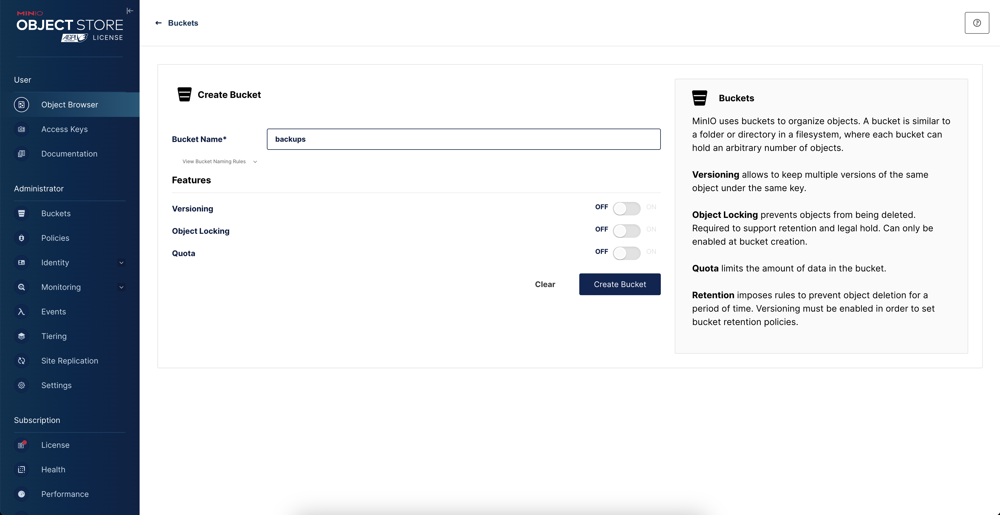
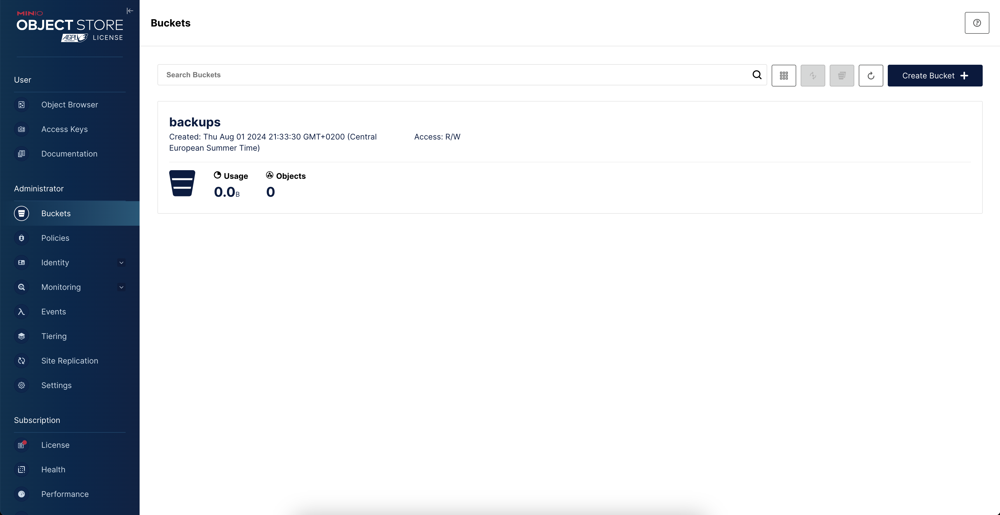
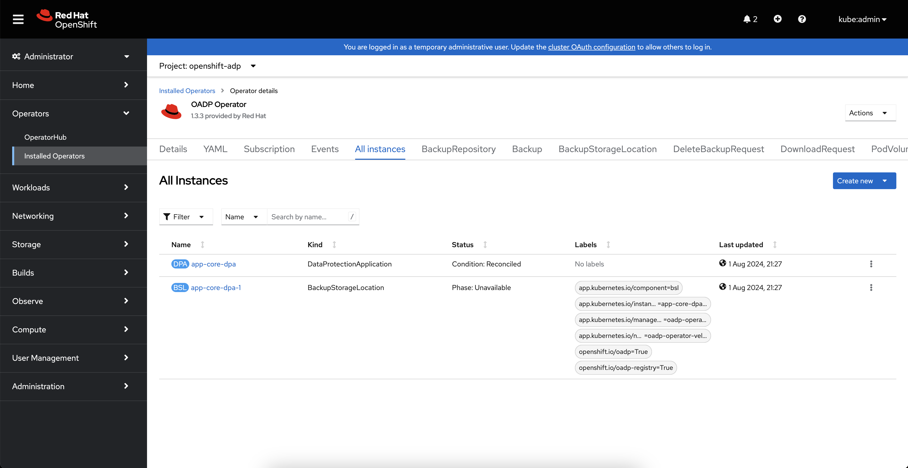
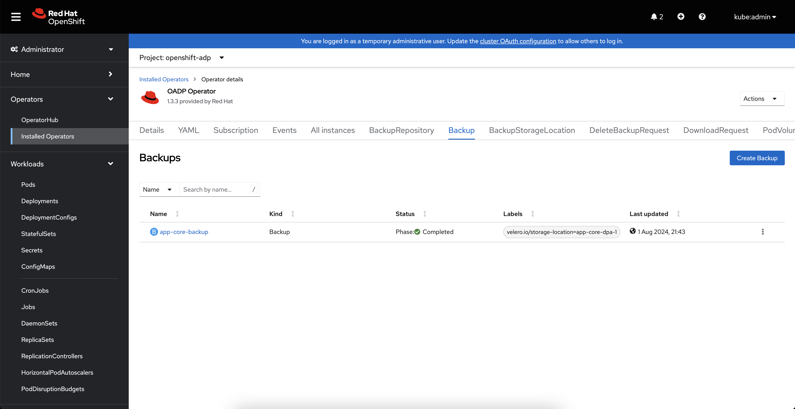
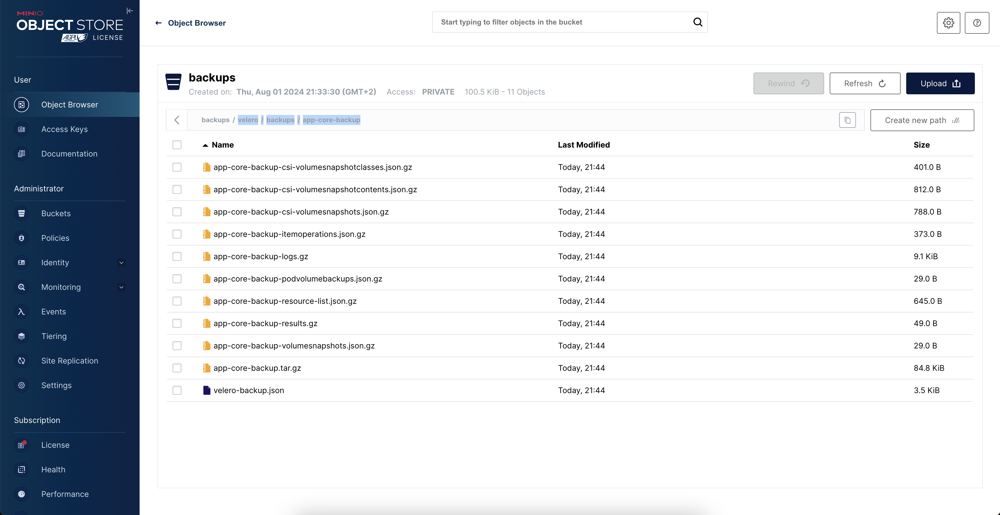

# This repo is to showcase OAPD (Red Hat OpenShift API for Data Protection) which is the simplest way to do backups at Red Hat OpenShift using Velero

Once you have your OpenShift cluster ready please login with admin credentials first.

Login to you desired Red Hat OpenShift cluster, for exmple:

`` oc login --token=sha256~[YOUR_TOKEN] --server=https://[YOUR_API_ROUTE]:6443 ``

Clone this repo and create all required projects and example application to backup:
```
oc apply -k ./
```
Install OADP operator using 'Operator Hub' as shown at the picture below, apply all to default settings:



Installed OADP operator should successfully apear at 'openshift-adp' namespace:



Open it to check provided API's:



Login to your newly created Minio S3 (user: minio password: minio123) and create bucket named 'backups':




Create Minio credentials secret and DataProtectionApplication:

```
oc apply -k ./adp
```

Check objects created at OADP operator 'All instances' tab:



Now you are ready to create your first backup!

```
oc apply -f ./backup-restore/app-core-backup.yaml
```

At the OADP operator 'Backups' tab you shoud see your first backup completed:



Backup files are located at your Minio S3 at the path backups/velero/backups/app-core-backup

