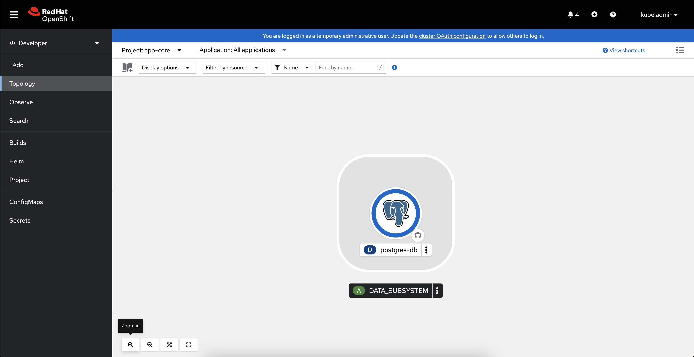

# Red Hat OpenShift API for Data Protection

### This repo is to showcase OAPD which is the simplest way to do backups at Red Hat OpenShift with Velero and very local instance of Minio S3 to provide necessary object storage

> [!NOTE]  
> Red Hat OpenShift Data Foundation provides you File, Block, and Object storage capabilities on Red Hat OpenShift cluster without additional software. ODF is not part of the following practice but worth rememebering for production deployments.

Once you have your OpenShift cluster ready please login with admin credentials first.

Login to you desired Red Hat OpenShift cluster, for exmple:

`` oc login --token=sha256~[YOUR_TOKEN] --server=https://[YOUR_API_ROUTE]:6443 ``

Clone this repo and create all required projects and example application to backup which is persistent Postgres (actually there is only two namespaces named minio and app-core that hold all of this scenario):
```
oc apply -k ./
```
Install OADP operator using 'Operator Hub' as shown at the picture below, apply all to default settings:


Installed OADP operator should successfully apear at 'openshift-adp' namespace:


Open it to check provided API's:


Login to your newly created Minio S3 (user: minio password: minio123) and create bucket named 'backups':


Create Minio credentials secret and DataProtectionApplication:

```
oc apply -k ./adp
```

Check objects created at OADP operator 'All instances' tab:


Now you are ready to create your first backup!

```
oc apply -f ./backup-restore/app-core-backup.yaml
```

At the OADP operator 'Backups' tab you shoud see your first backup completed:


Backup files are located at your Minio S3 at the path backups/velero/backups/app-core-backup


So, we have a backup let's delete our application namespace:

```
oc delete project app-core
```

But once we have our backup we can always restore it:

```
oc apply -f ./backup-restore/app-core-restore.yaml
```

Again, heading OADP operator 'Restore' tab you shoud see your first restore completed:


Your whole app-core namespace together with all objects persisted is back again!



Many thanks for being with me during this simple practice with OADP!


